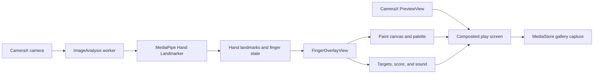
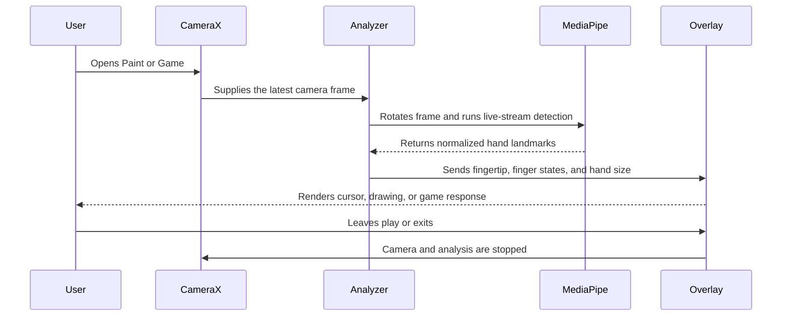

<div align="center">
  

  # Finger Spark

  **A camera becomes a canvas. A fingertip becomes the controller.**

  Native, offline hand tracking for playful learning on Android.

  `Kotlin` · `CameraX` · `MediaPipe` · `Lottie` · `Android 7.0+`
</div>

## About The Project

Finger Spark is an offline Android experience that lets children interact with the world through hand movement. The app uses the phone camera to follow the tip of the index finger in real time, then turns that movement into two simple activities: painting in the air and catching glowing targets.

The project began with a child's question: *What do you do with the knowledge you gain from Computer Science?* Finger Spark is one answer - technology used to encourage curiosity, movement, and creative play.

## Experiences

<table>
  <tr>
    <td width="50%" align="center">
      
      <h3>Paint</h3>
      <p>Draw glowing strokes by moving one raised index finger. Hold the fingertip over a palette color to select it, or hold four fingers up to clear the canvas.</p>
    </td>
    <td width="50%" align="center">
      
      <h3>Game</h3>
      <p>Guide the glowing fingertip cursor into each spark target. Every successful catch increases the score, moves the target, and can play sound feedback.</p>
    </td>
  </tr>
</table>

## Features

- Real-time index-fingertip tracking with MediaPipe Hand Landmarker
- Separate Paint and Game experiences with no overlapping mode UI
- Front and rear camera switching
- Bangla and English interface
- Personalized welcome using the child's locally saved name
- Gallery capture to `Pictures/Finger Spark`
- Optional sound feedback
- Tap-to-reveal camera controls for a clean play area
- Home and exit controls at the bottom of the camera screen
- Offline operation with no account, cloud service, analytics, or internet permission
- Camera and analysis shutdown whenever the user leaves active play

## How To Play

1. Open Finger Spark and let the launch animation finish.
2. Enter the child's name the first time the app is opened.
3. Choose `EN` or `BN` from the circular language control.
4. Allow camera access when Android asks for permission.
5. Choose **Paint** or **Game** from the home screen.
6. Keep the hand visible and point one index finger toward the camera.
7. Tap anywhere on the camera screen to reveal the bottom controls.

### Paint Controls

- **Draw:** raise the index finger and fold the other fingers.
- **Change color:** hover the fingertip over a palette swatch for about half a second.
- **Clear canvas:** raise the index, middle, ring, and little fingers and hold briefly.
- **Save artwork:** reveal the controls and tap the capture icon.

### Game Controls

- Move the index fingertip cursor onto the glowing target.
- Each captured target adds one spark to the score and appears in a new position.
- Use the sound control to enable or mute feedback.
- Use the camera-switch control when another viewpoint works better.

## Architecture

Finger Spark is a single-activity native Android application. Its components are intentionally small and local so the complete interaction loop can run without a network connection.



### Component Responsibilities

| Layer | Component | Responsibility |
| --- | --- | --- |
| App shell | `MainActivity` | Screen state, permissions, localization, camera lifecycle, capture, sound, and navigation |
| Camera | CameraX `Preview` + `ImageAnalysis` | Lifecycle-aware camera preview and continuous frame delivery |
| Vision | MediaPipe `HandLandmarker` | On-device hand landmark inference using the bundled `.task` model |
| Interaction | `FingerOverlayView` | Coordinate mapping, gestures, fingertip cursor, painting, palette, targets, and score |
| Home motion | `SparkBackgroundView`, `GalaxyCircleView`, Lottie | Branded splash, welcome, and home-screen motion |
| Local data | `SharedPreferences` | Stores only the chosen name and language on the device |
| Media output | Android `MediaStore` | Saves composed screenshots to the phone gallery |

## Runtime Workflow



## Offline And Privacy Design

- The manifest requests only `android.permission.CAMERA`.
- The MediaPipe model and Lottie animations are packaged inside the APK.
- Camera frames are analyzed on the device and are not uploaded.
- The child's name and language preference stay in local app storage.
- There are no background services. Returning home, switching away from the app, or exiting unbinds the camera.
- The exit action removes the app task so the camera cannot continue running in the background.

## Project Structure

```text
android-app/
├── app/src/main/
│   ├── assets/                  # MediaPipe model and Lottie files
│   ├── java/.../fingerspark/
│   │   ├── MainActivity.kt      # App, camera, permissions, and navigation
│   │   ├── FingerOverlayView.kt # Paint and Game interaction engine
│   │   ├── SparkBackgroundView.kt
│   │   ├── GalaxyCircleView.kt
│   │   └── CircleImageView.kt
│   └── res/                     # Icons, surfaces, colors, and creator image
├── docs/images/                 # README poster and mode previews
├── build.gradle.kts
└── README.md
```

## Build Requirements

- Android Studio with Android SDK 35
- JDK 17
- An Android device or emulator running Android 7.0 / API 24 or newer
- A physical Android phone is strongly recommended for camera and hand-tracking tests

Dependencies are downloaded during the first Gradle build. After that, the app itself operates fully offline.

## Build The APK

From PowerShell:

```powershell
cd android-app
.\gradlew.bat :app:assembleDebug
```

The APK is created at:

```text
app/build/outputs/apk/debug/app-debug.apk
```

## Install On A Phone

1. Enable **Developer options** and **USB debugging** on the Android phone.
2. Connect the phone by USB and approve the computer when Android asks.
3. Confirm the device is available with `adb devices`.
4. Install the debug build:

```powershell
.\gradlew.bat :app:installDebug
```

The current build has been installed successfully on a Samsung Galaxy S9 (`SM-G960F`).

## Technology

| Technology | Use |
| --- | --- |
| Kotlin | Native Android application logic |
| CameraX 1.5.3 | Preview, lens selection, lifecycle, and frame analysis |
| MediaPipe Tasks Vision 0.10.35 | Real-time on-device hand landmark detection |
| Lottie 6.6.7 | Launch and home-screen animation |
| Android Canvas | Drawing, cursor, palette, targets, and score rendering |
| MediaStore | Gallery-compatible screenshot saving |

## Creator

Created by **Shakil** - an engineer from NSU exploring how computer vision can turn children's curiosity into playful, hands-on experiences.

---

<div align="center">
  Built for curious hands and growing minds.
</div>
