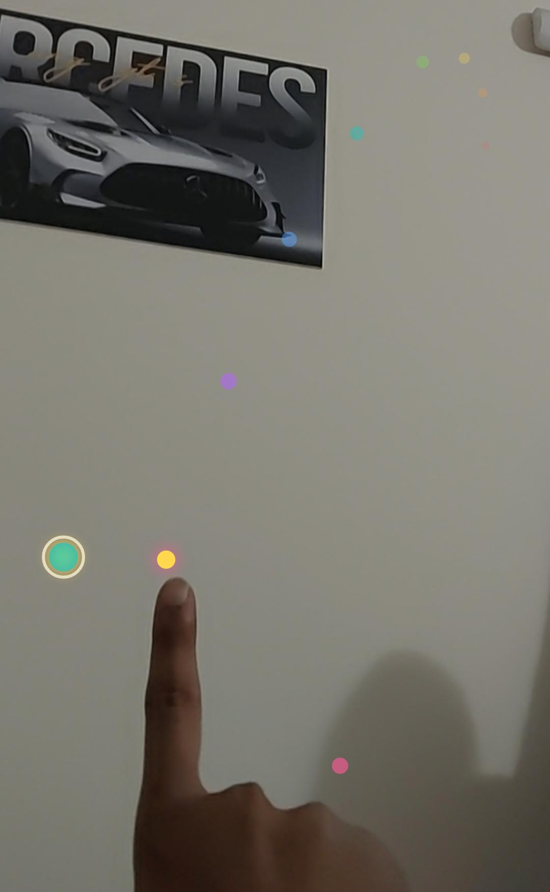

# Finger Spark

Finger Spark is an offline, kid-friendly Android app that turns a phone camera into a playful hand-tracking canvas. It uses MediaPipe and CameraX to follow the index fingertip in real time, then lets kids switch between two simple modes:

- `Paint` for colorful fingertip drawing
- `Game` for a spark-target style hand game

The first experience is intentionally warm and welcoming: a launch animation plays, the app asks for a name, and the home screen introduces the creator before letting the user choose a mode.

## How To Use

1. Open the app and wait for the launch animation to finish.
2. Enter a name when the app asks for one.
3. Allow camera permission when prompted.
4. Choose `Paint` or `Game` from the home screen.
5. Tap the screen in camera mode to reveal the bottom controls.
6. Use the back button to return home and the exit button to close the app.

## What It Does

- Opens the front camera and tracks the hand in real time
- Draws a small filled circle that follows the index fingertip
- Supports color painting with live fingertip motion
- Includes a target-catching game mode
- Offers Bangla and English language switching
- Includes camera switching, screen capture, sound toggle, back-to-home, and exit controls
- Works offline on the device after install

## Screens

### Paint Mode



Paint mode is the free-draw mode. It lets the fingertip paint on the camera view using live hand tracking. The color palette changes the brush color, and the app keeps the drawing responsive while you move your hand around the screen.

Paint mode includes:

- Fingertip drawing on the camera feed
- Color palette selection
- Simple kid-friendly brush feedback
- Screen capture support to save drawings

### Game Mode


Game mode is the spark-target challenge. A target appears and the hand tracker helps the app react as you move your finger through the camera view. It is designed to feel playful and rewarding without adding clutter.

Game mode includes:

- Spark target gameplay
- Score tracking
- Hand-driven interaction
- Sound feedback for game actions

## Tech Stack

- Kotlin
- CameraX
- MediaPipe Hand Landmarker
- Lottie animations
- Native Android views for overlays and UI

## Build

Open `android-app/` in Android Studio, or build from PowerShell:

```powershell
cd android-app
.\gradlew.bat :app:assembleDebug
```

The debug APK is created at:

```text
app/build/outputs/apk/debug/app-debug.apk
```

## Install On Phone

Enable Developer Options and USB Debugging on the Android phone, connect it by USB, then run:

```powershell
.\gradlew.bat :app:installDebug
```

## Notes

- The app is designed to stay offline.
- The web app in the parent project is unchanged.
- The Android app is a separate native project, not a WebView wrapper.
- The camera, switch camera, capture, sound, back-home, and exit controls appear only in camera mode after you tap the screen.
